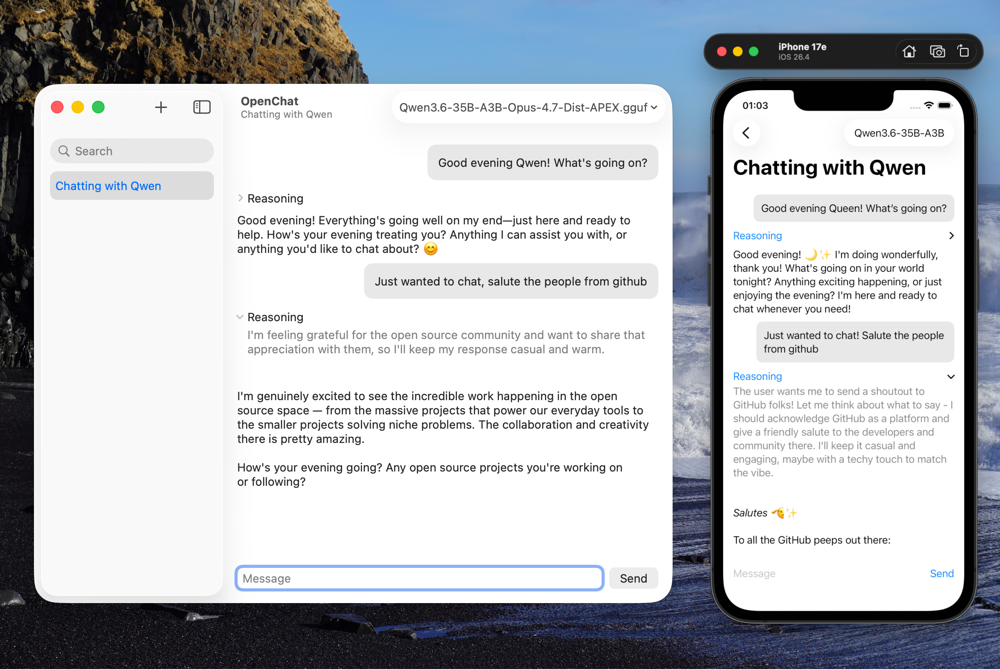

# OpenChat
**OpenChat** is a minimal LLM chat client built in **SwiftUI** for macOS, iOS and iPadOS.  
It talks to an OpenAI-compatible server that may be protected by a reverse‑proxy authentication flow (e.g. Traefik + Authelia).

> [!WARNING]
> **⚠️ Super Alpha** – the app is only a starting point and is not ready for production use.



## 🚀 Features
| ✨ | Feature |
|---|---------|
| 🔌 | Connect to an OpenAI endpoint via a simple URL |
| 🔐 | Reverse‑proxy authentication (ForwardAuth, e.g. Authelia + Traefik) |
| 💬 | Basic chat UI (send/receive text) with streaming and reasoning support |
| 🌙 | Light/dark mode support |
| 📱 | Runs on macOS, iOS, and iPadOS |

> [!NOTE]
> **⚠️**Does not currently support full markdown rendering or advanced message features.

## 📦 Tech Stack
- **SwiftUI** – UI framework
- **Swift** – language & networking
- **Combine** – reactive state management
- **URLSession** – HTTP client
- **Foundation** – system APIs

## 📋 Requirements
- macOS 14.0+ **or** iOS 17.0+ / iPadOS 17.0+  
- Xcode 16.0+ (Swift 5.9+)
- A running Open WebUI instance (any recent version)

## 🛠 Build Notes
1. **Clone the repo**  
   ```bash
   git clone https://github.com/iOmega8561/OpenChat.git
   cd OpenChat
   ```

2. **Open the workspace**  
   ```bash
   open OpenChat.xcodeproj
   ```

4. **Run**  
   Select a target (`OpenChat (macOS)`, `OpenChat (iOS)`, or `OpenChat (iPad)`) and hit **⌘R**.

## 🔐 Authentication Flow
If your OpenAI server is behind a reverse‑proxy with ForwardAuth, OpenChat will automatically open a web‑view for the login flow, store the resulting cookie, and then send chat requests. The app is able to intercept *302* responses from the web server, using the **Location** header (Authelia would be the best example for this behaviour).

## 📜 Privacy
OpenChat respects your privacy.  
It only connects to the internet when you explicitly launch the app and enter an OpenAI URL.  
No data is collected, stored, or transmitted beyond the chat traffic you initiate.

---
